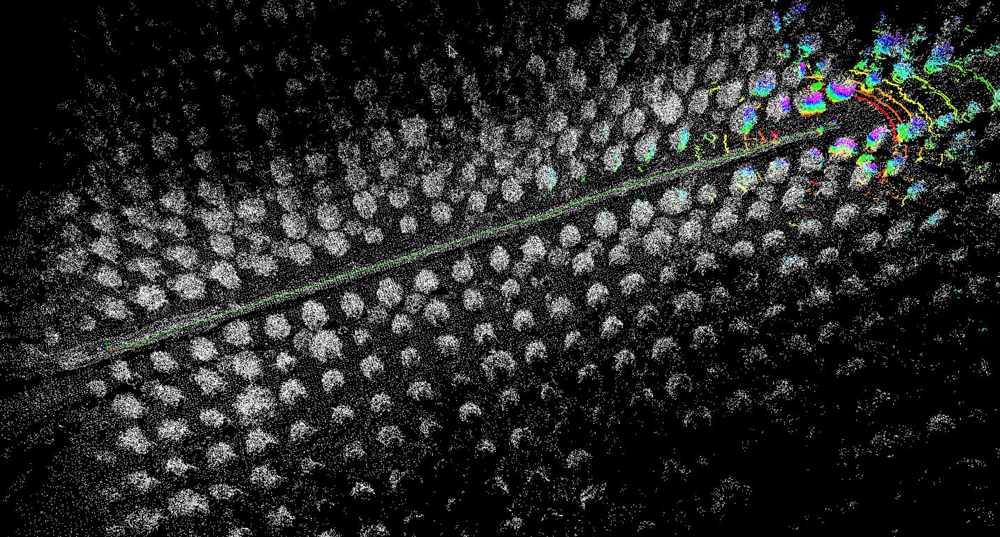

# 基于ros-noetic,ubuntu20.04的alom镜像
---
## 准备
1. 安装docker
2. 安装 tmux: ``apt install tmux``

[一个可用的bag](https://drive.google.com/file/d/1s05tBQOLNEDDurlg48KiUWxCp-YqYyGH/view)

## 安装
下载
git clone https://github.com/Lavinci/aloam-docker.git

在目录下运行
```bash
docker build -t loam .
```

## 运行
1. 运行脚本``./run.sh <your_bag_name>.bag``

    运行后会自动播放 test.bag

2. 建图完成后，在右侧窗口敲回车，pcd文件会保存在results目录下，然后按ctrl+C结束保存，选择最新的pcd文件即可
3. 按ctrl+b 再按shift+7退出运行 或分别ctrl+c输入exit退出运行


